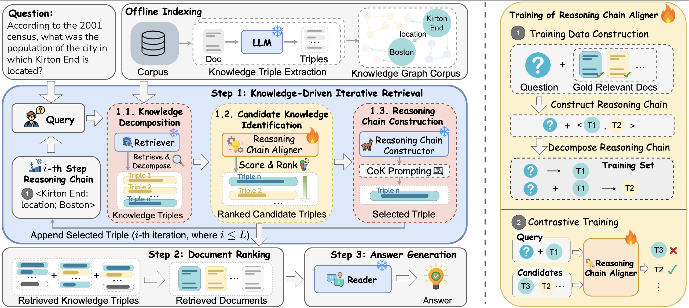

<h1 align="center">
    KiRAG: Knowledge-Driven Iterative Retriever for Enhancing Retrieval-Augmented Generation
</h1>

This repository contains the implementation of KiRAG framework, which leverages a knowledge-driven iterative retriever model to enhance the retrieval process of iterative RAG (iRAG) models.

Details about KiRAG can be found in our paper.  

## Introduction
KiRAG employs a knowledge triple-guided iterative retrieval process to retrieve relevant documents for questions that require multi-step reasoning. Specifically, KiRAG decomposes documents into knowledge triples and performs iterative retrieval with these triples to enable a factually reliable retrieval process. Moreover, KiRAG integrates reasoning into the retrieval process to dynamically identify and retrieve knowledge that bridges information gaps, effectively adapting to the evolving information needs. Empirical results show that KiRAG significantly outperforms existing iRAG models, with an average improvement of 9.40% in R@3 and 5.14% in F1 on multi-hop QA. 

<figure style="text-align: center;">
  
  <figcaption>Overview of KiRAG. Given a question, it employs a knowledge-driven iterative retrieval process (Step 1) to retrieve relevant knowledge triples, including three iterative steps: knowledge decomposition, candidate knowledge identification and reasoning chain construction. The retrieved triples are used to rank documents (Step 2), which are passed to the reader for answer generation (Step 3). (right) Training strategy for the Reasoning Chain Aligner, designed to optimise the identification of relevant knowledge triples at each step of the retrieval process.</figcaption>
</figure>

## Contents
- [Environment Setup](#setup)
- [Datasets](#datasets)
- [Offline Indexing](#offline-indexing)
- [Training](#training)
- [Evaluation](#evaluation)

## Environment Setup
Our code is built on PyTorch and Transformers, you can setup environment using the following commands: 
```
conda create -n kirag python=3.10
conda activate kirag
pip install -r requirements.txt 
```

## Datasets

### 1. Download Data 
The datasets used in our experiments can be downloaded from their official websites: [HotPotQA](https://hotpotqa.github.io/), [2WikiMultiHopQA](https://github.com/Alab-NII/2wikimultihop), [MuSiQue](https://github.com/StonyBrookNLP/musique), [Bamboogle](https://github.com/ofirpress/self-ask). For WebQuestions (WebQA) and Natural Questions (NQ), we use the version provided by [DPR](https://github.com/facebookresearch/DPR). 

### 2. Preprocess Data 
For multi-hop datasets, run the following command to obtain the preprocessed data:
```bash
python -m preprocessing.construct_odqa_for_multihop_qa \
    --dataset hotpotqa 
```
Note that you should first update the values of `LOAD_DATA_FOLDER` and `SAVE_DATA_FOLDER` in `construct_odqa_for_multihop_qa.py` to specify the appropriate directories. We provide a detailed explanation of the dataset structure and preprocessing steps in [dataset.md](preprocessing/dataset.md). 

You can also directly download the preprocessed data from the `datasets` folder at [here](https://osf.io/qw594/files/osfstorage). For Bamboogle, WebQA and NQ, we use the Wikipedia corpus provided by DRP, which can be downloaded from [here](https://dl.fbaipublicfiles.com/dpr/wikipedia_split/psgs_w100.tsv.gz). 

## Offline Indexing 
Before retrieving relevant documents, we first need to build indices for the document corpus and construct a knowledge graph corpus for retrieving knowledge triples.

### 1. Corpus Indexing 
Run the following command to build corpus index for dense retrieval: 
```bash
# calculate corpus embeddings 
python -m compute_corpus_embeddings \
    --corpus 2wikimultihopqa \
    --retriever_name E5Retriever \
    --save_dir checkpoint \
    --name e5_retriever \
    --index_folder 2wikimultihopqa

# construct faiss index 
python -m faiss_index_corpus \
    --index_folder checkpoint/e5_retriever/2wikimultihopqa \
    --embedding_size 1024
```
Note that you should update the value of `CORPUS_PATH` in `dataset/corpus.py` to specify the file path of each corpus. The corpus index will be saved to `save_dir/name/index_folder` folder.  

### 2. [Optional] Knowledge Triple Extraction
Use the following command to extract knowledge triples for all the documents within a corpus:
```bash 
python -m construct_kg_corpus \
    --hf_token huggingface_token \
    --dataset 2wikimultihopqa \
    --cached_kg_triples_file checkpoint/kg_corpus/musique/cached_kg_corpus.pkl 
```
Extracting knowledge triples for all the documents can take a long time. We provide the pre-built KG corpus for the HotPotQA, 2WikiMultiHopQA and MuSiQue datasets, which can be downloaded from the `kg_corpus` folder at [here](https://osf.io/qw594/files/osfstorage).

## Training
In KiRAG, the Reasoning Chain Aligner requires training to better identify candidate knowledge triples that can fill the information gaps in the reasoning process. We provide the training and development data at [here](https://osf.io/qw594/files/osfstorage). 

Run the following command to train the Reasoning Chain Aligner: 
```bash
python -m torch.distributed.launch --nproc_per_node 2 -m train_aligner \
    --data_folders data/hotpotqa/open_domain_data data/2wikimultihopqa/open_domain_data data/musique/open_domain_data \
    --backbone E5Retriever \
    --backbone_model_name intfloat/e5-large-v2 \
    --save_dir checkpoint \
    --name trained_reasoning_chain_aligner 
```

## Evaluation 
